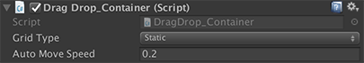
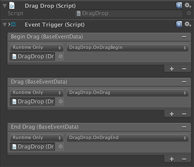

# Drag and Drop in uGUI

uGUI 通用交互实践：矩阵列表对象元素的拖动、放下与交换。

## 主要功能

在 Grid 布局区域内，拖动其中任一对象 ，将其拖到任一位置，放开后，自动使其与附近对象进行位置交换。

## 开发版本与依赖

- **Unity** ver. 5.6.6f2
- **DOTween** ver. 1.1.310

## 实现原理

1. 记录每个对象（DragDrop Object）的 层级顺序（Order） 和 初始位置（Local Position）。
2. 拖动时，记录被拖动对象（DragDrop Handler）的 Order 与实时位置。
3. 放开 DragDrop Handler ，根据其所在位置，计算其最近目标 Order ——该编号对应的对象即需要被交换的 Replaced Object 。
4. 交换 DragDrop Handler 所属的 DragDrop Object 和 Replaced Object 的编号。
5. 用动画方式交换 DragDrop Object 与 Replace Object 的 Local Position。

## 脚本用法

### 文件结构

```txt
_Components/DragDrop/
├── DragDropContainer.cs  // 拖动元素容器
├── DragDropObject.cs  // 被拖动对象所在实体
└── DragDrop.cs  // 被拖动对象（DragDrop Handler）的实际操作体
```

DragDropObject 与 DragDrop 分开的目的：

- 让结构更清晰。
- 方便计算位置。
- 可以分离被拖动对象（Handler）与被拖动本体对象（Object）。比如拖动图标时，可以设定只有图标残影随鼠标或手指移动，图标本体在原地不动，直到放开拖动时，图标才进行移动。

如果需要实时拖动交换，可以将 DragDropObject 对象设置为不可见（比如 alpha = 0）。DragDropObject 对象必须存在，它记录着对象的编号（Order）。

### DragDropContainer.cs 配置

此脚本需要挂在 Grid Layout Group 所在对象上。



Grid Layout Group 所在对象的 Rect Transform 的 Anchors 不可用 Stretch 方式，会使其元素位置错乱。同时，pivot 须设置为 (0, 1)：

```csharp
// 脚本中会强制设置。
girdRectTransform.pivot = new Vector2 (0, 1);
```

- Grid Type: 初始化 DragDropContainer 所在 Grid 的布局等内容。有两种方式：
  - Static: 静态初始化。Object在启动前就已放置好，程序启动时直接自动初始化。
  - Dynamic: 动态初始化。请在动态读取每一个 DragDrop Object 并设置为 DragDropContainer 的子对象后调用 DragDrop Handler 的 `ConnectRelatives()` 方法建立层级关联。然后，在全部 DragDrop Object 读取完之后，调用 DragDropContainer 的 `InitializeDragDrop()` 方法初始化。
- Canvas: 挂载 DragDropContainer 所在的 UI Canvas，确保在不同分辨率下可以没有偏差地拖动物件。
- Auto Move Speed: 填写交换位置所需要的时间（秒）。默认为0.2秒。

### DragDropObject.cs 配置

此脚本需要挂在 DragDropContainer 所在 Grid 下的每一个子对象上。

**注意**：对象不能与不存在的对象（inactive GameObject）进行位置（空白处）交换~~，如果想让对象移动到一个空的位置（与「空」交换），请在该位置添加一个不可见（Inactive or alpha = 0）的对象~~。


### DragDrop.cs 配置

此脚本需要挂在 DragDropObject 对象的子对象上。这个子对象是用户直接操作拖动的对象，请给它必要的尺寸大小。



本脚本的拖动放下操作使用 uGUI 内置的 Event Trigger 控制。请添加此组件，并加入三种委托：

- Begin Drag: 调用 `DragDrop.OnDragBegin()` 方法。
- Dragging: 调用 `DragDrop.OnDrag()` 方法。
- End Drag: 调用 `DragDrop.OnDragEnd()` 方法。

用户自己的方法也可以插入其中。

## 工程内示例

### Example 1

DragDropObject 与 DragDrop 对象都可见。拖动放开后，DragDropObject 对象才进行交换。

### Example 2

DragDropObject 不可见。拖动放开后，直接交互拖动元素（DragDrop 对象）。

### Example 3

只有一行情况下的拖动与交换示例。

### Example 4

行数与列数不同情况下的拖动与交换示例。
