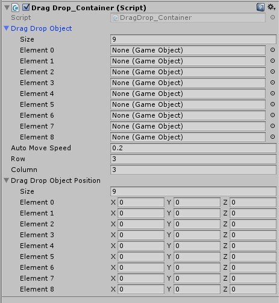
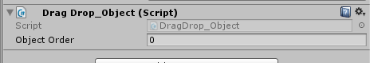

# Drag and Drop in uGUI

uGUI 通用交互实践：矩阵列表对象元素的拖动、放下与交换。

**Unity** 5.3.5f1, **DOTween** 1.1.135

## 主要功能

在Grid布局区域内，拖动其中任一 Object ，将其拖到任一位置，放开后，自动使其与附近 Object 进行位置交换。

## 实现原理

1. 记录每个 Object 的 Order 和 Local Position。
2. 拖动时，记录被拖动对象（Drag Object）的 Order 与实时位置。
3. 放开 Drag Object ，根据其所在位置，计算其最近目标 Order ——该编号对应的对象即需要被交换的 Replaced Object 。
4. 交换 Drag Object 和 Replaced Object 的编号。用动画方式交换 Drag Object 与 Replace Object 的 Local Position。
5. 完成。

## 脚本用法

### 文件结构

```
_component/dragdrop/
├── DragDrop_Container.cs  // 拖动元素容器
├── DragDrop_Object.cs  // 被拖动对象所在实体
├── DragDrop.cs  // 被拖动对象实际操作点
```

DragDrop_Object 与 DragDrop 分开的目的：

- 让结构更清晰。
- 方便计算位置。
- 可以分离被拖动状态对象与被拖动本体对象。比如拖动图标时，可以设定只有图标残影随鼠标或手指移动，图标本体在原地不动，直到放开拖动时，图标才进行移动。

如果需要实时拖动交换，可以将 DragDrop_Object 对象设置为不可见（比如 alpha = 0）。DragDrop_Object 对象必须存在，它记录着对象的编号（Order）。

### DragDrop_Container.cs 配置

此脚本需要挂在 Grid Layout Group 所在对象上。



- Drag Drop Object: 填写列表中对象元素的个数（Size）。Element 不必填写，脚本会自动计算。
- Auto Move Speed: 填写交换位置所需要的时间（秒）。默认为0.2秒。
- Row: 矩阵列表的行数。
- Column: 矩阵列表的列数。
- Drag Drop Object Position: 填写列表中对象元素位置的个数（Size）——和 Drag Drop Object 相同。Element 不必填写，脚本会自动计算。

### DragDrop_Object.cs 配置

此脚本需要挂在 DragDrop_Container 下每一个被拖动的对象上。



- Object Order: 以此填写对象编号。

### DragDrop.cs 配置

此脚本需要挂在 DragDrop_Object 对象的子对象上。这个子对象是用户直接操作拖动的对象，请给它必要的尺寸大小。


- Drag Drop Container: 放置 Drag Drop Container 所在对象。
- Drag Drop Object: 放置其父对象。 

本脚本使用 uGUI 内置的 Event Trigger 控制。请添加此组件，并加入三种委托：

- Begin Drag: 使用DragDrop.OnDragBeign() 方法。
- Drag: 使用DragDrop.OnDrag() 方法。
- End Drag: 使用DragDrop.OnDragEnd() 方法。

用户自己的方法也可以插入其中。


